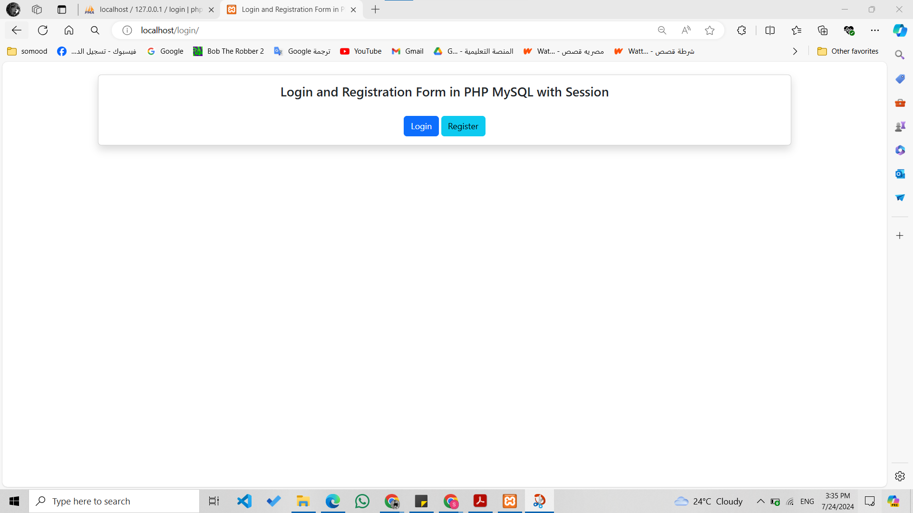
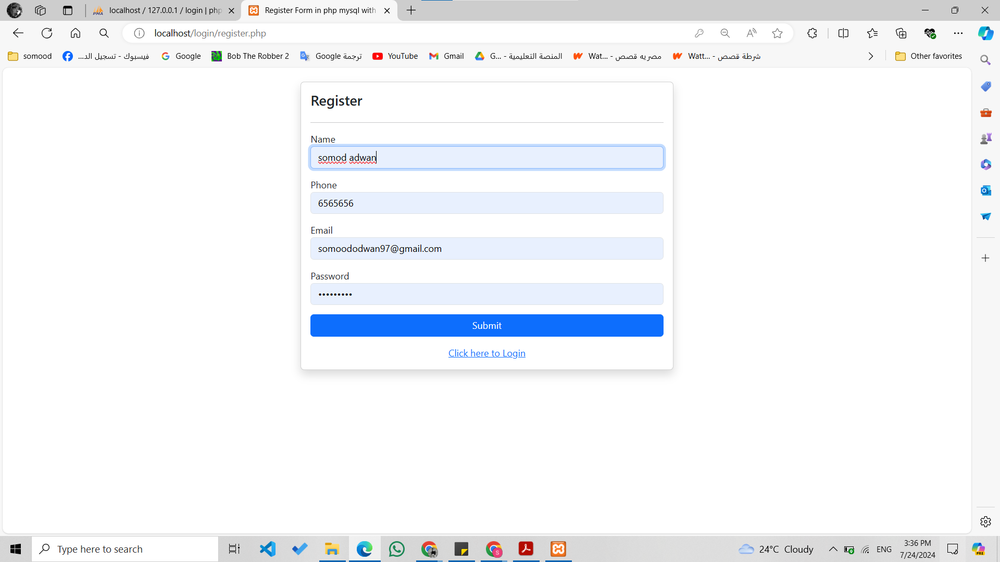
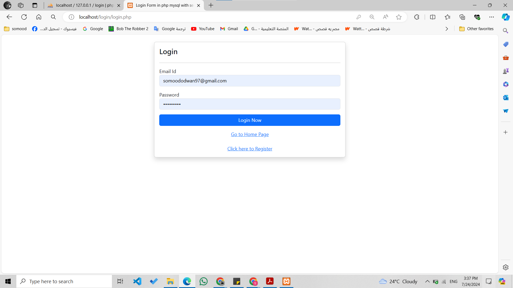
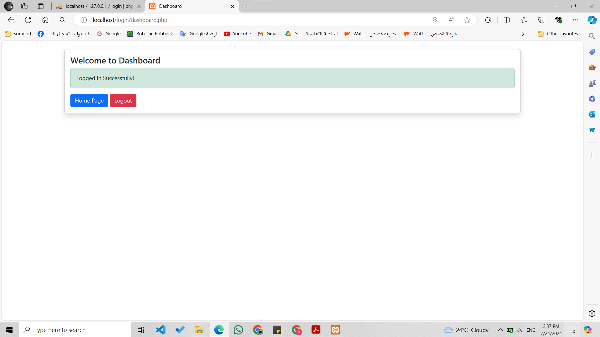

# PHP MySQL User Signup Login System
A login and signup form using HTML, PHP, and MySQL. This form allows users to register and login. All information is stored in a MySQL database. After successful login the user is redirected to their dashboard. 
## Technologies Used
- `HTML`
- `CSS`
- `PHP`
- `MySQL`

## Features

* Stores passwords in DB as hashes
* Easy logout via logout.php
* Passwords are hashed and stored (You can't view the original password of the user).
* Username and email validation is done.

## Preview
### Homepage

### Signup Page

### Signin Page

### Dashboard Page

